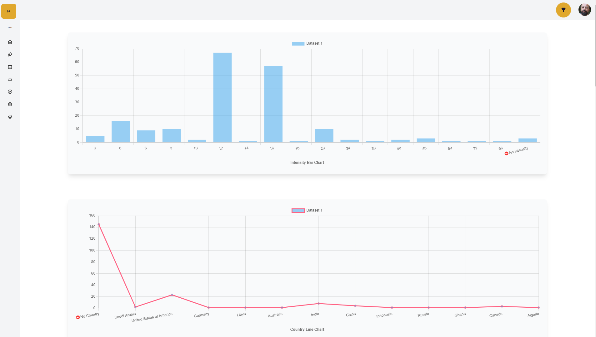
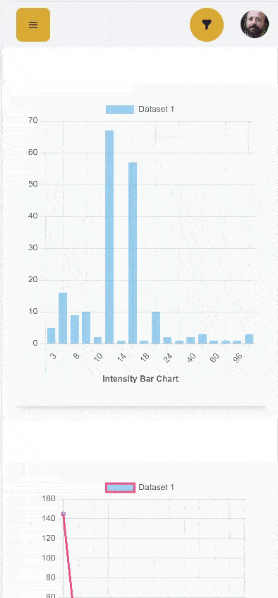

# Dashboard charts

Live Site link 👉 [Click Here](https://)
Client Github link 👉 [Click Here](https://)

#### About The site:

Getting data for dashboard and show multiple chats based on the data. using the api user can filter data.

### Desktop Screenshot



### Mobile Preview



### Features

- Get chart data using single api .../api/data
- cam filter data using the api

### Technologies

- NodeJs
- Express
- Cors
- Mongodb
- Mongoose

### dependencies

```json
  "cors": "^2.8.5",
  "dotenv": "^16.0.1",
  "express": "^4.18.1",
  "mongoose": "^6.3.4"
```
